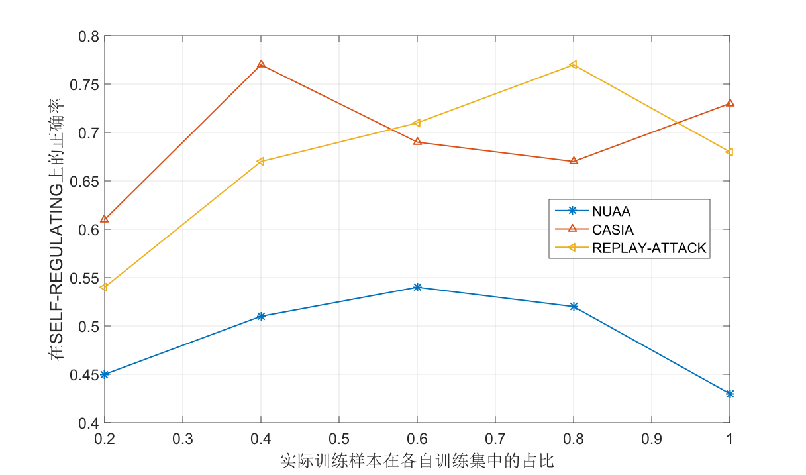
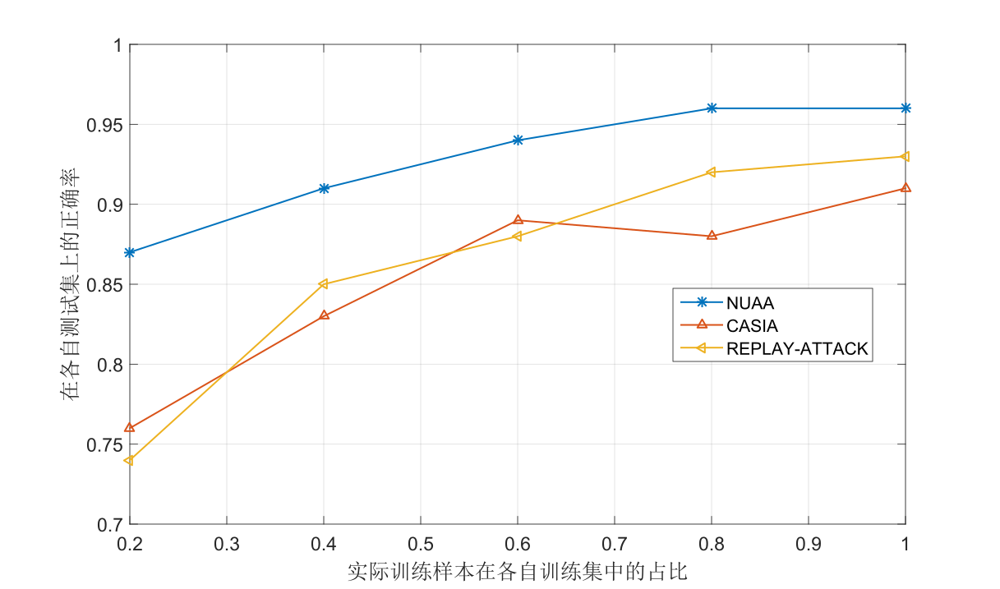
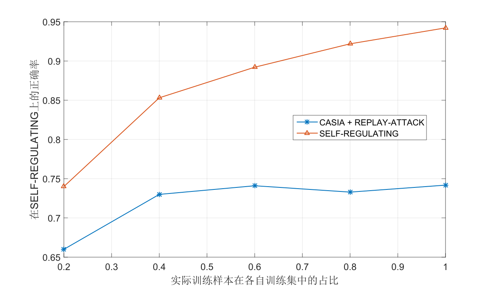
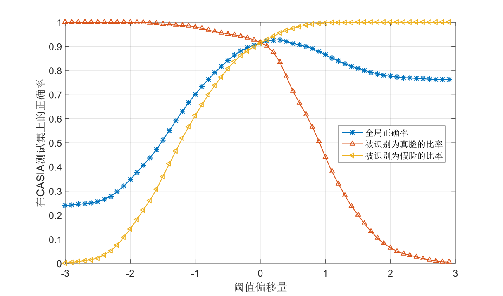
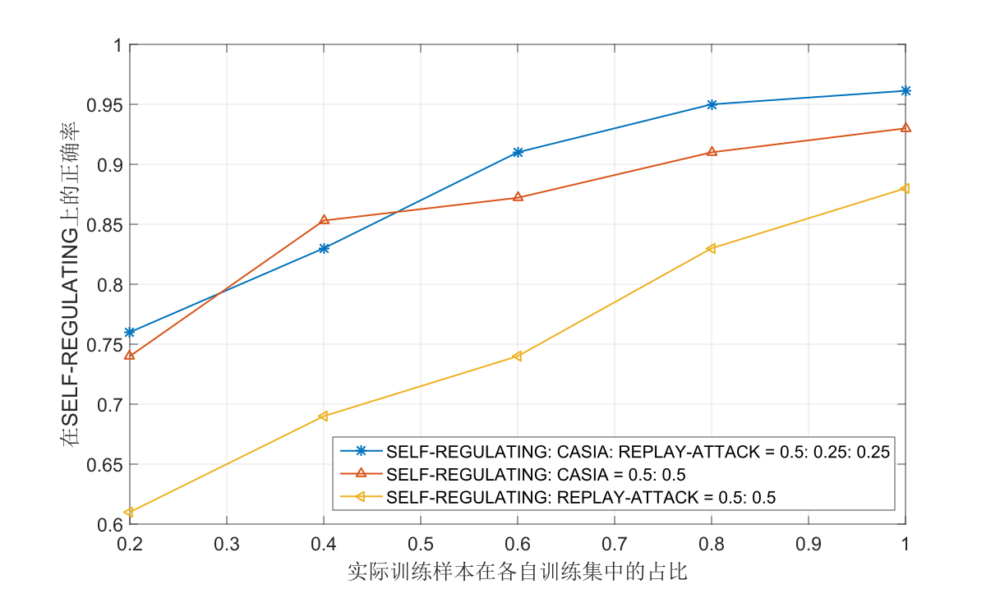
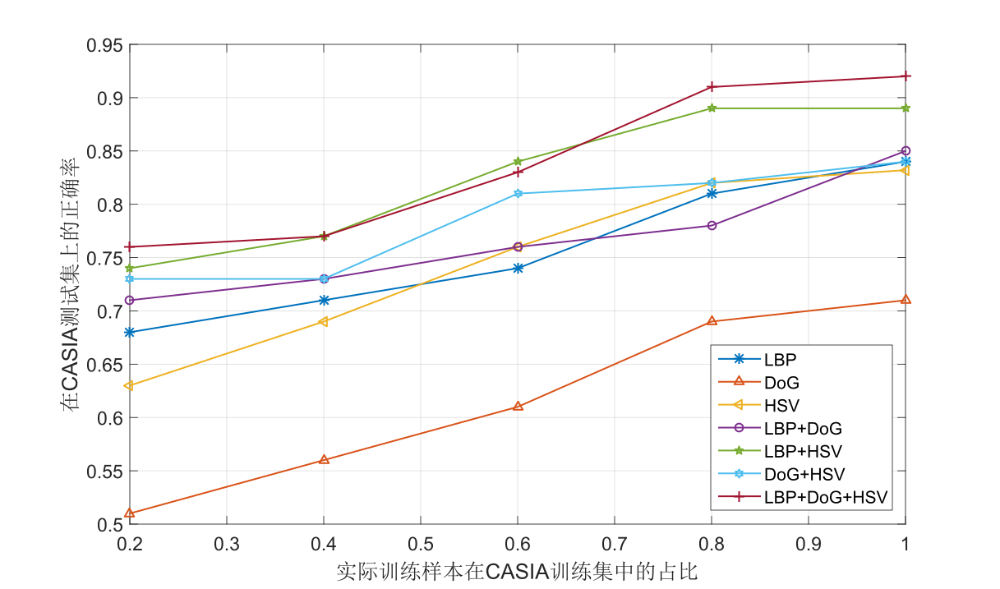

# Face Liveness Detection

[](https://github.com/NarcissusHliangZhao/Face-Liveness-Detection/blob/master/LICENSE.txt)

According to the difference between real images and false photos, texture and statistical feature are extracted in different ways, this project trains SVM classifers with features below:

`DoG (Difference of Gaussian)`;
`LBP (Local Binary Pattern)`;
`HSV histograms`;
`HOOF (Histograms of Optical Flows)`.

The dataset used are:

`NUAA`;
`CASIA_FASD`;
`REPLAY-ATTACK`.

The features and datasets are combined with each other in different ways by setting control groups. The detals can be found [here](https://github.com/NarcissusHliangZhao/Face-Liveness-Detection/tree/master/version/Matlab).

## Version
Face Liveness Detection is published in 3 languages.

`C++ Version`.
You can train your SVM classifier and deploy it on the server for work.

`MATLAB Version`.
You can train different classifiers by setting control groups and analyze the correct rate.
You can learn how to set control groups in this [page](https://github.com/NarcissusHliangZhao/Face-Liveness-Detection/tree/master/version/Matlab).

`Python Version (updating)`.
It's updating now.

## Results








## Others
A package of Face Liveness Detection.

**Citation**:

> [1] HuaCheng Liu. The Gordian Technique research of Face Liveness Detection[D]. NingBo University 2014.

> [2] REPLAY-ATTACK Database.

```
@INPROCEEDINGS{Chingovska_BIOSIG-2012,
                author = {Chingovska, Ivana and Anjos, Andr{\'{e}} and Marcel, S{\'{e}}bastien},
              keywords = {biometric, Counter-Measures, Local Binary Patterns, Spoofing Attacks},
                 month = september,
                 title = {On the Effectiveness of Local Binary Patterns in Face Anti-spoofing},
               journal = {IEEE BIOSIG 2012},
                  year = {2012}
        }
```

> [3] CASIA-FASD Database.

```
@INPROCESSINGS{zhang2012face,
                 title = {A face antispoofing database with diverse attacks},
                author = {Zhang, Zhiwei and Yan, Junjie and Liu, Sifei and Lei, Zhen and Yi, Dong and Li, Stan Z},
             booktitle = {Biometrics (ICB), 2012 5th IAPR international conference on},
                 pages = {26--31},
                  year = {2012},
          organization = {IEEE}
        }
```

> [4] NUAA Database.

> [5] HOOF Toolbox.
```
R. Chaudhry, A. Ravichandran, G. Hager and R. Vidal.
Histograms of Oriented Optical Flow and Binet-Cauchy Kernels on Nonlinear Dynamical Systems for the Recognition of Human Actions.
CVPR, 2009.
```

> [6] LibSVM Toolovbox.

**References**:

- [Face_Liveness_Detection](https://github.com/allenyangyl/Face_Liveness_Detection)

**License**:

MIT License.

**Author**:

Hai-Liang Zhao (hliangzhao97@gmail.com);
